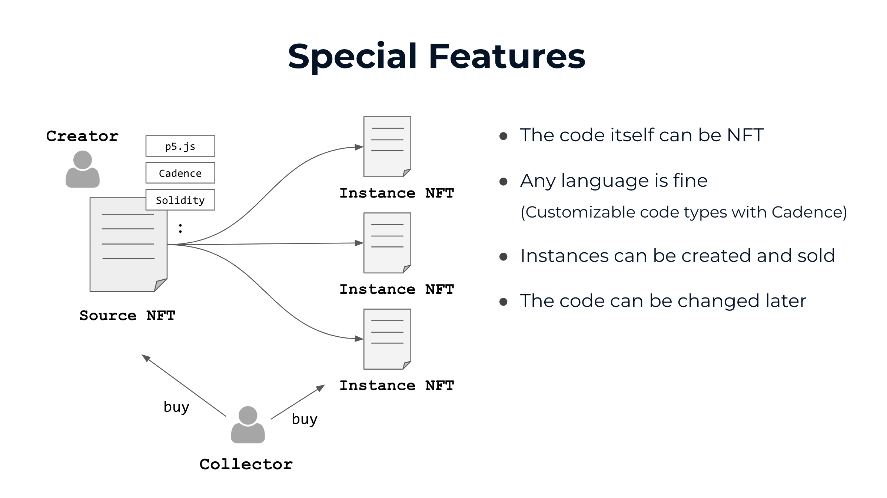
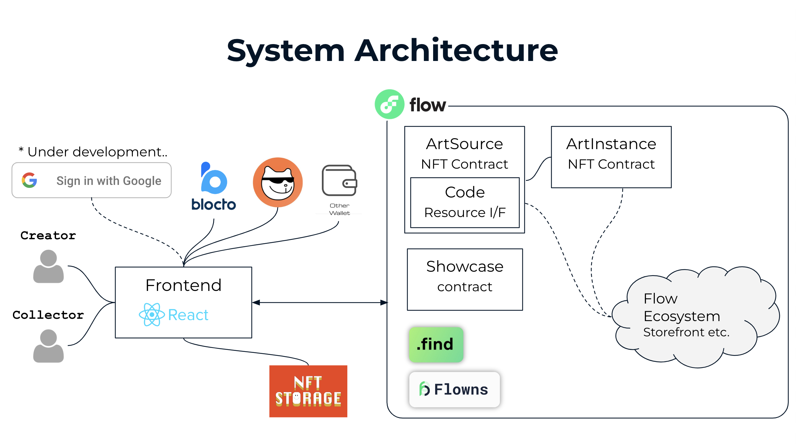
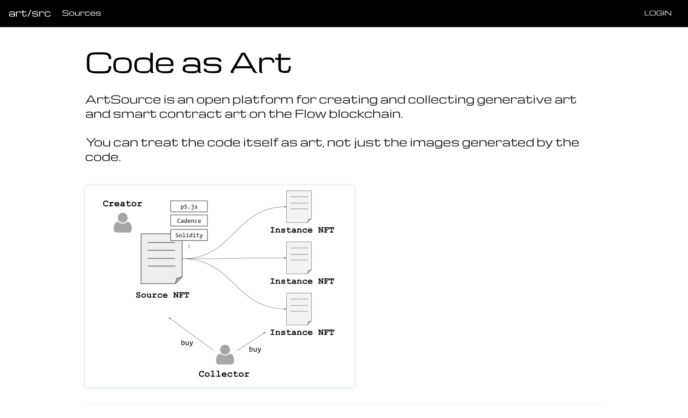
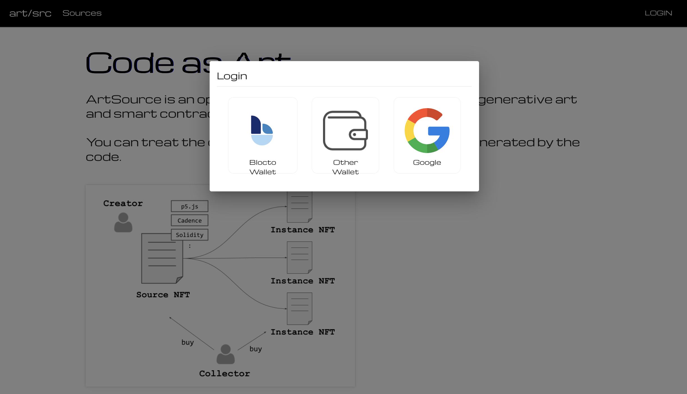
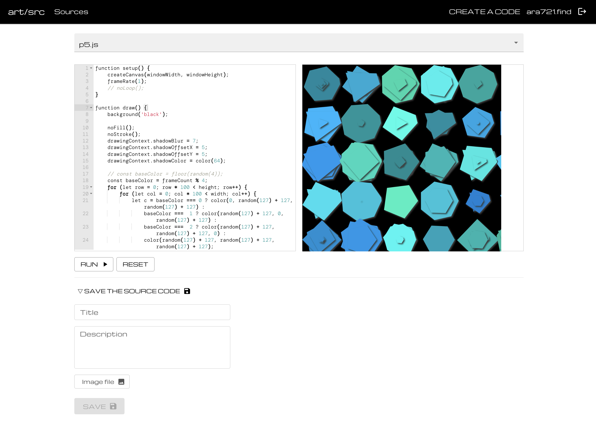

# ArtSource

## ⭐ Links

- Project page: https://devfolio.co/projects/artsource-5247
- Slide: https://docs.google.com/presentation/d/1Qb0eisrffh4pWQKWqEQZh2VZZ8fjlqMZ4STxVExmZy0/edit?usp=sharing

## 🎬 Demo

- https://artsrc.web.app/

## 🔎 Project Overview

- ArtSource is an open platform for creating and collecting generative art and smart contract art on the Flow blockchain.

- You can treat the code itself as art, not just the images generated by the code.

## 📷 Screenshots

## The problem ArtSource solves

- With this platform, any artwork by the code can be left behind permanently.

### Breadth of expression and constraints

- Many generative art works are available on ArtBlocks and fxhash. However, there is still much that cannot be expressed on these platforms. For example, they have restrictions on programming languages and do not allow for customization of contracts. They focus on handling images generated by the code individually and do not support contract art that does not issue NFTs.

### User Base

- Also, many creative coders, especially Japanese, are not interested in publishing their work on such platforms. They do it because they enjoy daily creative coding and often do not create works for commercial purposes. But I love their work and think they should preserve it in a place where it will last longer than on the fragile web2 platform. To do this, we need a system that allows easy login, no expensive fees, and the ability to change code as often as you like, just like "OpenProcessing" and other web2 services. ArtSource makes this possible.

### Market

- On the other hand, this product also makes it possible to earn money by selling the code itself as a work of art. Recently, the number of artists who use smart contracts to create artwork as their main job has been increasing, but they are currently only able to make money by creating NFT contracts. If smart contracts could be handled in their entirety, there would be more creative works of art.

## Acknowledgments

- This product is based on [the React Template provided by ArtBlocks](https://github.com/ArtBlocks/artblocks-engine-react) under the MIT license. Thank you very much.

